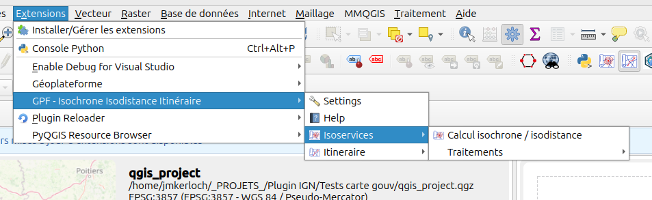
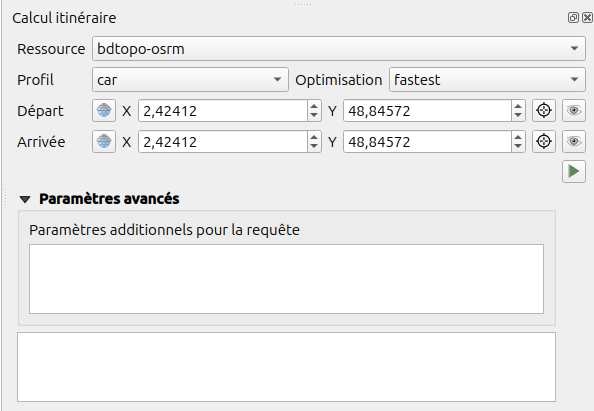
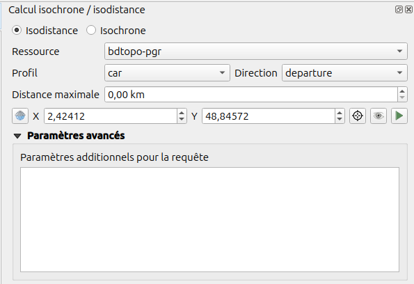
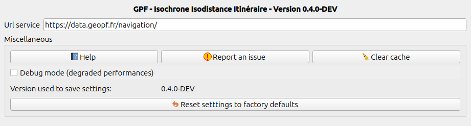

# Guide d'utilisation

Extension QGIS pour utilisation du service de calcul d'isochrone, isodistance et d'itinéraire de la Géoplateforme.

Cette extension contient des outils pour utiliser le service depuis des interfaces graphiques dédiées avec intéractions sur la carte QGIS et des traitements QGIS pour des utilisations en lot.

## Menu

Le menu de l'extension permet d'afficher les différents outils disponibles.

Vous pouvez aussi afficher l'aide en ligne et les paramètres de l'extension.

## Barre d'outils

L'extension ajoute une barre d'outils QGIS.

## Outil de calcul d'itinéraire

Un outil de calcul d'itinéraire est disponible dans la barre d'outil après installation du plugin.

Un dockwidget est affiché permettant de sélectionner un point départ et un point d'arrivée sur la carte.

Il est ensuite possible de choisir la ressource et le couple profil / optimisation utilisé pour le calcul.

## Outil de calcul d'isochrone et isodistance

Un outil de calcul d'isochrone et isodistance est disponible dans la barre d'outil après installation du plugin.

Un dockwidget est affiché permettant de sélectionner un point de calcul sur la carte.

Il est ensuite possible de choisir la ressource, le profil et la direction utilisés pour le calcul.

----

## Réglages

Les réglages utilisés par l'extension sont disponibles depuis le menu :

### Variables d'environnement

Ces paramètres peuvent être définis via des variables d'environnement. Ceci permet une configuration de l'extension directement par la Direction des Systèmes d'Information (DSI).

Le tableau suivant reprend les paramètres disponibles avec la variable d'environnement associée et la valeur par défaut:

|Paramètre                         | Variable d'environnement                                | Valeur par défaut                          |
|----------------------------------|---------------------------------------------------------|--------------------------------------------|
|URL requête API Géoplateforme     | `QGIS_GPF_ISOCHRONE_ISODISTANCE_ITINERAIRE_URL_SERVICE` | `https://data.geopf.fr/navigation/`        |
